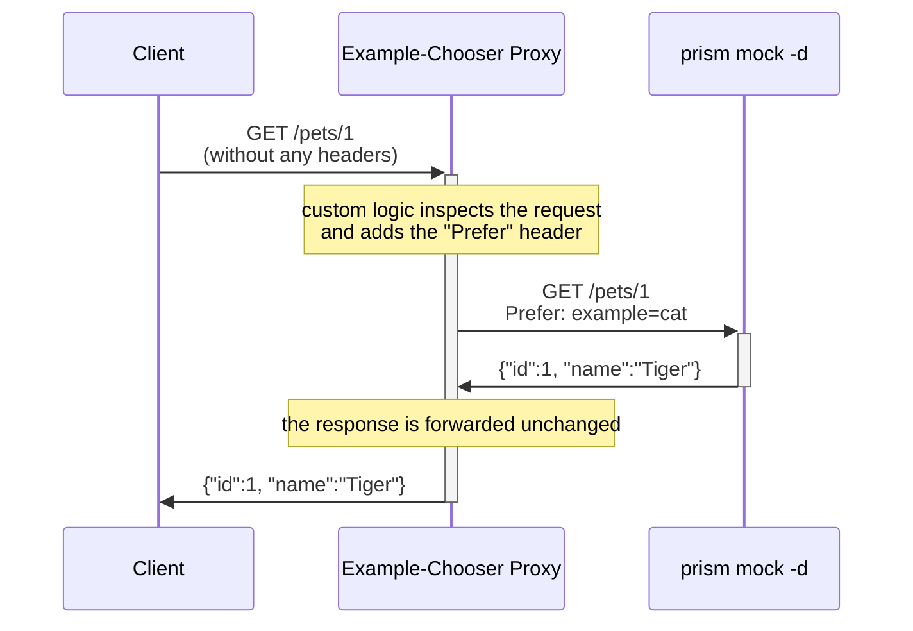

- [Goal](#goal)
- [Context](#context)
- [Solution](#solution)
  - [Prerequisites](#prerequisites)
  - [Quick Start](#quick-start)
- [Customize](#customize)

---------------------------------------------------------------------

## Goal

Provide an example proxy server that allows arbitrarily complex
example-selection logic to an upstream [Stoplight
Prism](https://github.com/stoplightio/prism) server in "mock" mode.

## Context

For the full discussion, see https://github.com/stoplightio/prism/issues/1838.

[Stoplight Prism](https://github.com/stoplightio/prism) offers [the limited
ability to dynamically select
examples](https://docs.stoplight.io/docs/prism/83dbbd75532cf-http-mocking#dynamic-response-generation).
Some users have requested:
- more complex example selection logic within Prism, or
- the ability to select examples based only on query string, or request body
  content

So far, these enhancements lie outside the bounds of Prism's goals.

An alternative approach is to add a proxy server which includes this complex
behavior, and use it to add the necessary `Prefer:` HTTP header to the request
to Prism.  This approach has several advantages:
- we don't need a YAML/JSON DSL embedded in OpenAPI documents _suitable to all
  users_,
- no need to further complicate [the existing Prism decision
  engine](https://docs.stoplight.io/docs/prism/83dbbd75532cf-http-mocking#prism-decision-engine)
  to accomodate partial or contradictory matches, and
- greater flexibility for a variety of client, server, and network constraints.

## Solution



### Prerequisites

- [Docker Compose](https://docs.docker.com/compose/install/#installation-scenarios)

### Quick Start

Start the example-chooser proxy with the following command.  (Later you'll
probably want the `--detach` option, but omitting it for now makes it easy to
see how the proxy interacts with Prism).

```sh
docker compose -f docker-compose.yaml up
```

In a different terminal, run the following commands.

```sh
% curl -s http://localhost:4010/pets/1
{"id":1,"name":"Fluffy"}

% curl -s http://localhost:4010/pets/2
{"id":2,"name":"Spot"}

% curl -v http://localhost:4010/pets/3
{"id":-14714018,"name":"lorem ipsum"}
```

Your docker-compose session should have logged something like the following.

```
[+] Running 2/0
 ⠿ Container prism           Created                                                                          0.0s
 ⠿ Container examplechooser  Recreated                                                                        0.1s
Attaching to examplechooser, prism
examplechooser  |  * Debug mode: off
examplechooser  | WARNING: This is a development server. Do not use it in a production deployment. Use a production WSGI server instead.
examplechooser  |  * Running on all addresses (0.0.0.0)
examplechooser  |  * Running on http://127.0.0.1:5000
examplechooser  |  * Running on http://192.168.128.2:5000
examplechooser  | Press CTRL+C to quit
prism           | [2:40:46 AM] › [CLI] …  awaiting  Starting Prism…
prism           | [2:40:49 AM] › [CLI] ℹ  info      GET        http://0.0.0.0:4010/pets/neque
prism           | [2:40:49 AM] › [CLI] ▶  start     Prism is listening on http://0.0.0.0:4010
examplechooser  | [2023-03-11 02:40:51,100] INFO in app: added Prefer: example=cat
prism           | [2:40:51 AM] › [HTTP SERVER] get /pets/1 ℹ  info      Request received
prism           | [2:40:51 AM] ›     [NEGOTIATOR] ℹ  info      Request contains an accept header: */*
prism           | [2:40:51 AM] ›     [VALIDATOR] ✔  success   The request passed the validation rules. Looking for the best response
prism           | [2:40:51 AM] ›     [NEGOTIATOR] ✔  success   Found a compatible content for */*
prism           | [2:40:51 AM] ›     [NEGOTIATOR] ✔  success   Responding with the requested status code 200
examplechooser  | 192.168.128.1 - - [11/Mar/2023 02:40:51] "GET /pets/1 HTTP/1.1" 200 -
examplechooser  | [2023-03-11 02:41:04,121] INFO in app: added Prefer: example=dog
prism           | [2:41:04 AM] › [HTTP SERVER] get /pets/2 ℹ  info      Request received
prism           | [2:41:04 AM] ›     [NEGOTIATOR] ℹ  info      Request contains an accept header: */*
prism           | [2:41:04 AM] ›     [VALIDATOR] ✔  success   The request passed the validation rules. Looking for the best response
prism           | [2:41:04 AM] ›     [NEGOTIATOR] ✔  success   Found a compatible content for */*
prism           | [2:41:04 AM] ›     [NEGOTIATOR] ✔  success   Responding with the requested status code 200
examplechooser  | 192.168.128.1 - - [11/Mar/2023 02:41:04] "GET /pets/2 HTTP/1.1" 200 -
prism           | [2:41:13 AM] › [HTTP SERVER] get /pets/3 ℹ  info      Request received
prism           | [2:41:13 AM] ›     [NEGOTIATOR] ℹ  info      Request contains an accept header: */*
prism           | [2:41:13 AM] ›     [VALIDATOR] ✔  success   The request passed the validation rules. Looking for the best response
prism           | [2:41:13 AM] ›     [NEGOTIATOR] ✔  success   Found a compatible content for */*
prism           | [2:41:13 AM] ›     [NEGOTIATOR] ✔  success   Responding with the requested status code 200
examplechooser  | 192.168.128.1 - - [11/Mar/2023 02:41:13] "GET /pets/3 HTTP/1.1" 200 -
```

In particular, notice the log entries like the following, where the
example-chooser proxy has added a `Prefer:` header to the request it forwarded
to Prism.

```
examplechooser  | [2023-03-11 02:40:51,100] INFO in app: added Prefer: example=cat
```

## Customize

The logic in [app.py](./app.py) is very simple in this example.

```python
def example_name(request):
    if request.path.endswith('/1'):
        return 'cat'
    elif request.path.endswith('/2'):
        return 'dog'
    else:
        return None
```

Because you have access to the complete [Flask
Request](https://flask.palletsprojects.com/en/2.2.x/api/#flask.Request).  Prism
users have expressed interest in varying example responses based on:
- HTTP headers
- query parameters
- request body content

Additionally, you could load in the same OpenAPI file used by Prism and write
logic that depends on:
- [named examples](https://swagger.io/docs/specification/adding-examples/),
- [extension properties](https://swagger.io/docs/specification/openapi-extensions/), or
- matching other properties of pre-made examples to the request

Notice that the container built by [Dockerfile](./Dockerfile) is:
- **poorly suited to rapid-feedback development**; you'll probably want to use
  [Flask's debug mode](https://flask.palletsprojects.com/en/2.2.x/cli/#debug-mode)
  for debugging and/or automatic reloading;
- **poorly suited to any Internet-facing, public deployment**; this is an
  internal development tool only.
